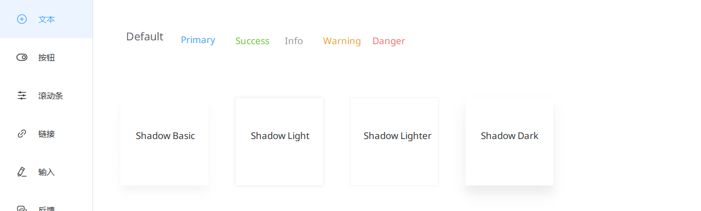
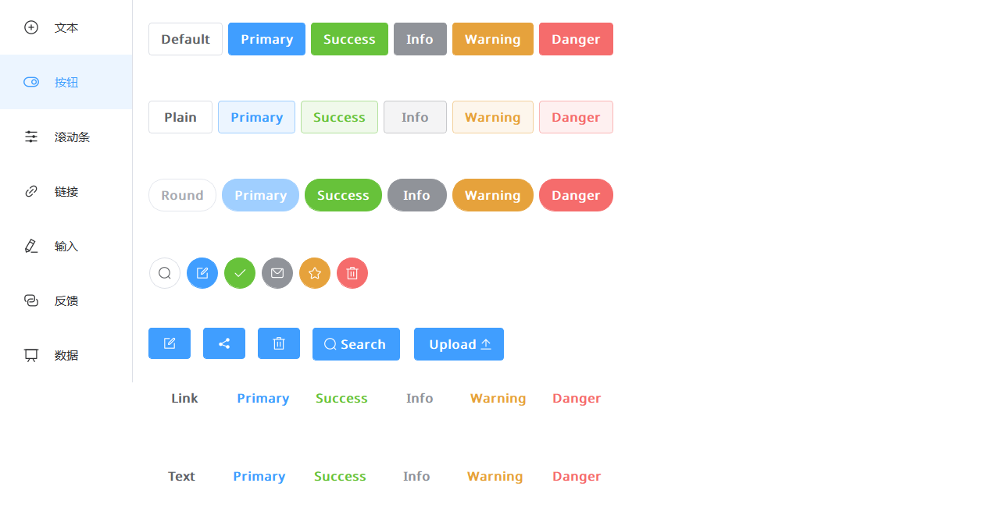
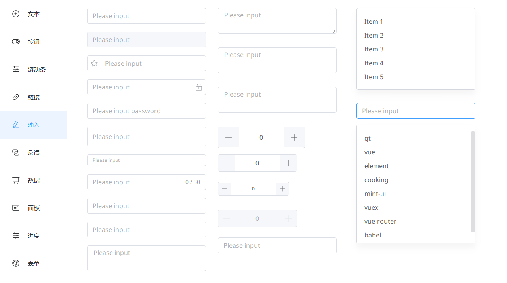
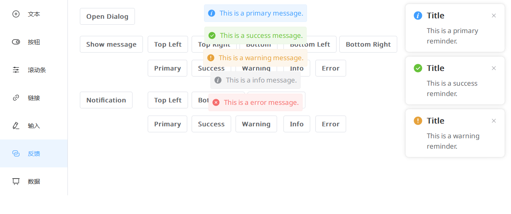
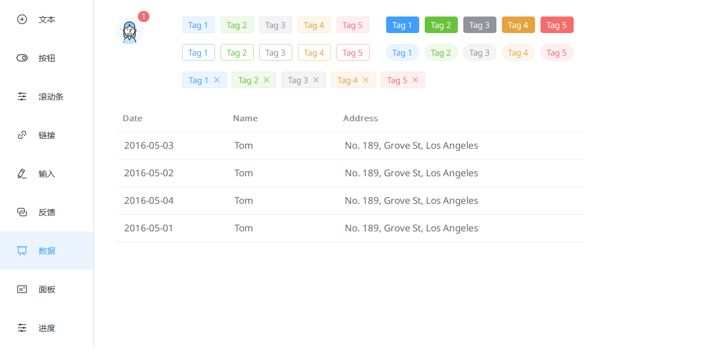
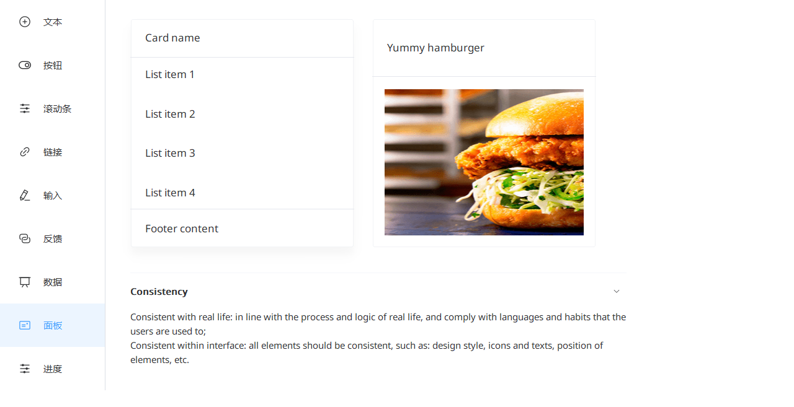
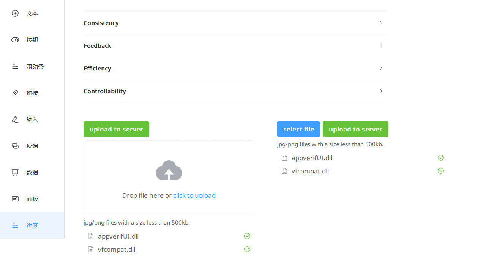
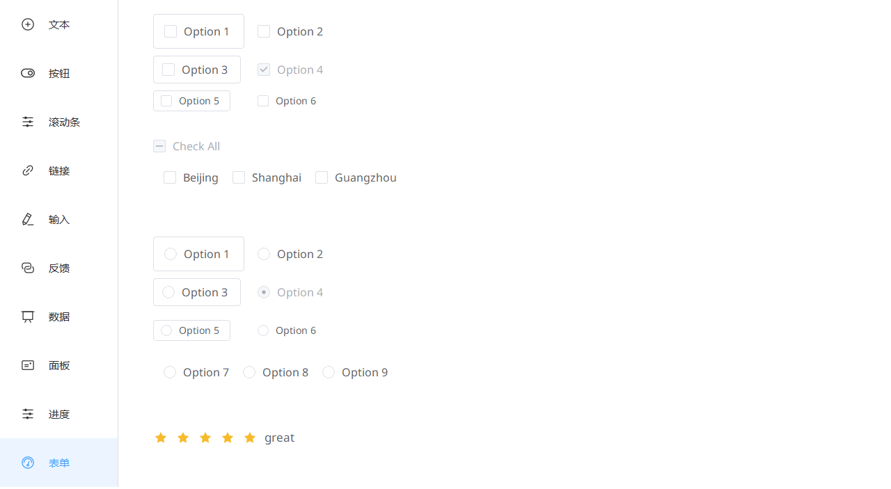

# qt-element-ui

一个基于 C++ Qt 6 开发的桌面 UI 组件库，模拟实现了 Web UI 组件库 Element Plus (Element UI) 的相关控件。

> 为软件生态做出属于自己的一份贡献是我一直以来的目标，奈何本人实力实在有限，如有大佬愿提点一二，本人不胜感激。

## 特性

- 基于 Qt 6 开发，支持现代 C++17 标准
- 参考 Element Plus 设计风格，提供一致的视觉体验
- 丰富的组件库，涵盖常用 UI 控件
- 跨平台支持（Windows、macOS、Linux）

## 环境要求

- Qt 6.x
- C++17 或更高版本
- CMake 或 qmake 构建系统

## 快速开始

### 构建项目

```bash
# 使用 qmake
qmake qt-element-ui.pro
make

# 或使用 Qt Creator 直接打开 qt-element-ui.pro
```

### 运行示例

编译完成后，运行生成的可执行文件即可查看组件示例。

## 组件列表

### 基础组件
- **Button** - 按钮
- **Text** - 文本
- **Icon** - 图标
- **Link** - 链接
- **Container** - 布局容器

### 表单组件
- **Checkbox** - 复选框
- **Radio** - 单选框
- **Input** - 输入框 (InputText, InputNumber, InputLine, InputTag)
- **Switch** - 开关
- **Select** - 选择器
- **Autocomplete** - 自动补全
- **Cascader** - 级联选择器
- **DatePicker** - 日期选择器
- **TimePicker** - 时间选择器
- **DateTimePicker** - 日期时间选择器
- **TimeSelect** - 时间选择
- **Upload** - 上传
- **Rate** - 评分
- **ColorPicker** - 颜色选择器
- **Slider** - 滑块
- **Form** - 表单

### 数据展示
- **Table** - 表格
- **Tag** - 标签
- **Progress** - 进度条
- **Tree** - 树形控件
- **TreeSelect** - 树形选择
- **Pagination** - 分页
- **Badge** - 徽章
- **Avatar** - 头像
- **Card** - 卡片
- **Collapse** - 折叠面板
- **Timeline** - 时间线
- **Descriptions** - 描述列表
- **Statistic** - 统计数值
- **Empty** - 空状态
- **Result** - 结果
- **Skeleton** - 骨架屏
- **Image** - 图片

### 导航组件
- **Tabs** - 标签页
- **Breadcrumb** - 面包屑
- **Dropdown** - 下拉菜单
- **Sidebar** - 侧边栏
- **Steps** - 步骤条
- **Anchor** - 锚点
- **Segmented** - 分段控制器

### 反馈组件
- **Message** - 消息提示
- **MessageBox** - 消息框
- **Notification** - 通知
- **Dialog** - 对话框
- **Drawer** - 抽屉
- **Tooltip** - 文字提示
- **Popover** - 弹出框
- **Popconfirm** - 气泡确认框
- **Alert** - 警告

### 其他组件
- **Divider** - 分割线
- **Calendar** - 日历
- **Carousel** - 走马灯
- **Backtop** - 回到顶部
- **InfiniteScroll** - 无限滚动
- **Affix** - 固钉
- **Space** - 间距
- **Splitter** - 分割器
- **Transfer** - 穿梭框
- **Tour** - 漫游式引导
- **Watermark** - 水印
- **Mention** - 提及
- **Scrollbar** - 滚动条
- **Shadow** - 阴影

## 项目结构

```
qt-element-ui/
├── components/          # 组件源码
│   ├── include/        # 组件头文件
│   └── src/            # 组件实现
├── examples/           # 示例程序
├── resources/          # 资源文件（图标、字体等）
├── images/             # 截图示例
└── qt-element-ui.pro   # qmake 项目文件
```

## 截图示例



---



---



---



---



---



---



---



## 贡献

欢迎提交 Issue 和 Pull Request 来帮助改进项目！

## 许可证

本项目采用 MIT 许可证，详见 [LICENSE](LICENSE) 文件。

## 致谢

本项目灵感来源于 [Element Plus](https://element-plus.org/)，感谢 Element Plus 团队提供的优秀设计。